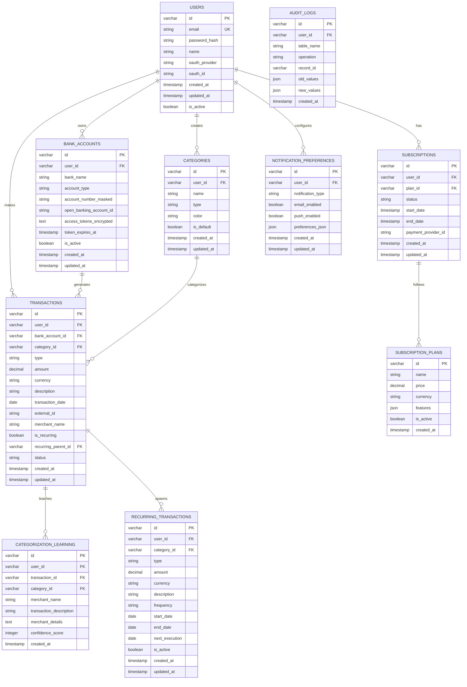

# Esquema do Banco de Dados - Monex (MySQL)

Este documento descreve o esquema completo do banco de dados MySQL do sistema Monex, incluindo todas as tabelas, colunas, tipos de dados, chaves e relacionamentos necessários para suportar as funcionalidades definidas no PRD.

## 1. Diagrama Entidade-Relacionamento (ERD)



## 2. Especificação Detalhada das Tabelas (MySQL)

### 2.1. Tabela: users
**Descrição:** Armazena informações dos usuários do sistema.

```sql
CREATE TABLE users (
    id VARCHAR(36) PRIMARY KEY DEFAULT (UUID()),
    email VARCHAR(255) NOT NULL UNIQUE,
    password_hash VARCHAR(255) NULL,
    name VARCHAR(100) NOT NULL,
    oauth_provider VARCHAR(50) NULL,
    oauth_id VARCHAR(255) NULL,
    created_at TIMESTAMP DEFAULT CURRENT_TIMESTAMP,
    updated_at TIMESTAMP DEFAULT CURRENT_TIMESTAMP ON UPDATE CURRENT_TIMESTAMP,
    is_active BOOLEAN DEFAULT TRUE,
    
    INDEX idx_users_email (email),
    INDEX idx_users_oauth (oauth_provider, oauth_id)
);
```

### 2.2. Tabela: subscription_plans
**Descrição:** Define os planos de assinatura disponíveis.

```sql
CREATE TABLE subscription_plans (
    id VARCHAR(36) PRIMARY KEY DEFAULT (UUID()),
    name VARCHAR(100) NOT NULL,
    price DECIMAL(10,2) NOT NULL,
    currency VARCHAR(3) DEFAULT 'BRL',
    features JSON NULL,
    is_active BOOLEAN DEFAULT TRUE,
    created_at TIMESTAMP DEFAULT CURRENT_TIMESTAMP
);
```

### 2.3. Tabela: subscriptions
**Descrição:** Controla as assinaturas dos usuários.

```sql
CREATE TABLE subscriptions (
    id VARCHAR(36) PRIMARY KEY DEFAULT (UUID()),
    user_id VARCHAR(36) NOT NULL,
    plan_id VARCHAR(36) NOT NULL,
    status ENUM('pending', 'active', 'canceled', 'expired') DEFAULT 'pending',
    start_date TIMESTAMP NOT NULL,
    end_date TIMESTAMP NULL,
    payment_provider_id VARCHAR(255) NULL,
    created_at TIMESTAMP DEFAULT CURRENT_TIMESTAMP,
    updated_at TIMESTAMP DEFAULT CURRENT_TIMESTAMP ON UPDATE CURRENT_TIMESTAMP,
    
    INDEX idx_subscriptions_user_status (user_id, status),
    FOREIGN KEY (user_id) REFERENCES users(id) ON DELETE CASCADE,
    FOREIGN KEY (plan_id) REFERENCES subscription_plans(id)
);
```

### 2.4. Tabela: bank_accounts
**Descrição:** Contas bancárias conectadas via Open Banking.

```sql
CREATE TABLE bank_accounts (
    id VARCHAR(36) PRIMARY KEY DEFAULT (UUID()),
    user_id VARCHAR(36) NOT NULL,
    bank_name VARCHAR(100) NOT NULL,
    account_type ENUM('checking', 'savings', 'investment') NOT NULL,
    account_number_masked VARCHAR(20) NULL,
    open_banking_account_id VARCHAR(255) NOT NULL UNIQUE,
    access_tokens_encrypted TEXT NULL,
    token_expires_at TIMESTAMP NULL,
    is_active BOOLEAN DEFAULT TRUE,
    created_at TIMESTAMP DEFAULT CURRENT_TIMESTAMP,
    updated_at TIMESTAMP DEFAULT CURRENT_TIMESTAMP ON UPDATE CURRENT_TIMESTAMP,
    
    INDEX idx_bank_accounts_user (user_id),
    UNIQUE INDEX idx_bank_accounts_ob_id (open_banking_account_id),
    FOREIGN KEY (user_id) REFERENCES users(id) ON DELETE CASCADE
);
```

### 2.5. Tabela: categories
**Descrição:** Categorias de despesas e receitas.

```sql
CREATE TABLE categories (
    id VARCHAR(36) PRIMARY KEY DEFAULT (UUID()),
    user_id VARCHAR(36) NULL,
    name VARCHAR(100) NOT NULL,
    type ENUM('expense', 'revenue') NOT NULL,
    color VARCHAR(7) NULL,
    is_default BOOLEAN DEFAULT FALSE,
    created_at TIMESTAMP DEFAULT CURRENT_TIMESTAMP,
    updated_at TIMESTAMP DEFAULT CURRENT_TIMESTAMP ON UPDATE CURRENT_TIMESTAMP,
    
    INDEX idx_categories_user_type (user_id, type),
    FOREIGN KEY (user_id) REFERENCES users(id) ON DELETE CASCADE
);
```

### 2.6. Tabela: transactions
**Descrição:** Todas as transações financeiras (manuais e importadas).

```sql
CREATE TABLE transactions (
    id VARCHAR(36) PRIMARY KEY DEFAULT (UUID()),
    user_id VARCHAR(36) NOT NULL,
    bank_account_id VARCHAR(36) NULL,
    category_id VARCHAR(36) NULL,
    type ENUM('expense', 'revenue') NOT NULL,
    amount DECIMAL(15,2) NOT NULL,
    currency VARCHAR(3) DEFAULT 'BRL',
    description TEXT NOT NULL,
    transaction_date DATE NOT NULL,
    external_id VARCHAR(255) NULL,
    merchant_name VARCHAR(255) NULL,
    is_recurring BOOLEAN DEFAULT FALSE,
    recurring_parent_id VARCHAR(36) NULL,
    status ENUM('completed', 'pending', 'canceled') DEFAULT 'completed',
    created_at TIMESTAMP DEFAULT CURRENT_TIMESTAMP,
    updated_at TIMESTAMP DEFAULT CURRENT_TIMESTAMP ON UPDATE CURRENT_TIMESTAMP,
    
    INDEX idx_transactions_user_date (user_id, transaction_date DESC),
    INDEX idx_transactions_category (category_id),
    INDEX idx_transactions_external (external_id),
    FOREIGN KEY (user_id) REFERENCES users(id) ON DELETE CASCADE,
    FOREIGN KEY (bank_account_id) REFERENCES bank_accounts(id) ON DELETE SET NULL,
    FOREIGN KEY (category_id) REFERENCES categories(id) ON DELETE SET NULL,
    FOREIGN KEY (recurring_parent_id) REFERENCES recurring_transactions(id) ON DELETE SET NULL
);
```

### 2.7. Tabela: recurring_transactions
**Descrição:** Modelo para transações recorrentes.

```sql
CREATE TABLE recurring_transactions (
    id VARCHAR(36) PRIMARY KEY DEFAULT (UUID()),
    user_id VARCHAR(36) NOT NULL,
    category_id VARCHAR(36) NULL,
    type ENUM('expense', 'revenue') NOT NULL,
    amount DECIMAL(15,2) NOT NULL,
    currency VARCHAR(3) DEFAULT 'BRL',
    description TEXT NOT NULL,
    frequency ENUM('daily', 'weekly', 'monthly', 'yearly') NOT NULL,
    start_date DATE NOT NULL,
    end_date DATE NULL,
    next_execution DATE NOT NULL,
    is_active BOOLEAN DEFAULT TRUE,
    created_at TIMESTAMP DEFAULT CURRENT_TIMESTAMP,
    updated_at TIMESTAMP DEFAULT CURRENT_TIMESTAMP ON UPDATE CURRENT_TIMESTAMP,
    
    INDEX idx_recurring_next_exec (next_execution, is_active),
    FOREIGN KEY (user_id) REFERENCES users(id) ON DELETE CASCADE,
    FOREIGN KEY (category_id) REFERENCES categories(id) ON DELETE SET NULL
);
```

### 2.8. Tabela: categorization_learning
**Descrição:** Dados para aprendizado de máquina na categorização.

```sql
CREATE TABLE categorization_learning (
    id VARCHAR(36) PRIMARY KEY DEFAULT (UUID()),
    user_id VARCHAR(36) NULL,
    transaction_id VARCHAR(36) NOT NULL,
    category_id VARCHAR(36) NOT NULL,
    merchant_name VARCHAR(255) NULL,
    transaction_description TEXT NULL,
    merchant_details JSON NULL,
    confidence_score INT DEFAULT 100,
    created_at TIMESTAMP DEFAULT CURRENT_TIMESTAMP,
    
    INDEX idx_categorization_merchant (merchant_name),
    INDEX idx_categorization_category (category_id),
    FOREIGN KEY (user_id) REFERENCES users(id) ON DELETE SET NULL,
    FOREIGN KEY (transaction_id) REFERENCES transactions(id) ON DELETE CASCADE,
    FOREIGN KEY (category_id) REFERENCES categories(id) ON DELETE CASCADE
);
```

### 2.9. Tabela: notification_preferences
**Descrição:** Preferências de notificação dos usuários.

```sql
CREATE TABLE notification_preferences (
    id VARCHAR(36) PRIMARY KEY DEFAULT (UUID()),
    user_id VARCHAR(36) NOT NULL,
    notification_type VARCHAR(50) NOT NULL,
    email_enabled BOOLEAN DEFAULT TRUE,
    push_enabled BOOLEAN DEFAULT TRUE,
    preferences_json JSON NULL,
    created_at TIMESTAMP DEFAULT CURRENT_TIMESTAMP,
    updated_at TIMESTAMP DEFAULT CURRENT_TIMESTAMP ON UPDATE CURRENT_TIMESTAMP,
    
    UNIQUE INDEX idx_notif_user_type (user_id, notification_type),
    FOREIGN KEY (user_id) REFERENCES users(id) ON DELETE CASCADE
);
```

### 2.10. Tabela: audit_logs
**Descrição:** Log de auditoria para operações sensíveis.

```sql
CREATE TABLE audit_logs (
    id VARCHAR(36) PRIMARY KEY DEFAULT (UUID()),
    user_id VARCHAR(36) NULL,
    table_name VARCHAR(50) NOT NULL,
    operation ENUM('INSERT', 'UPDATE', 'DELETE') NOT NULL,
    record_id VARCHAR(36) NOT NULL,
    old_values JSON NULL,
    new_values JSON NULL,
    created_at TIMESTAMP DEFAULT CURRENT_TIMESTAMP,
    
    INDEX idx_audit_logs_user (user_id, created_at DESC),
    INDEX idx_audit_logs_table (table_name, record_id),
    FOREIGN KEY (user_id) REFERENCES users(id) ON DELETE SET NULL
);
```

## 3. Script de Criação Completo (MySQL)

```sql
-- Criação do database
CREATE DATABASE IF NOT EXISTS monex 
CHARACTER SET utf8mb4 
COLLATE utf8mb4_unicode_ci;

USE monex;

-- Criação das tabelas na ordem correta (respeitando FK)

-- 1. Users (base)
CREATE TABLE users (
    id VARCHAR(36) PRIMARY KEY DEFAULT (UUID()),
    email VARCHAR(255) NOT NULL UNIQUE,
    password_hash VARCHAR(255) NULL,
    name VARCHAR(100) NOT NULL,
    oauth_provider VARCHAR(50) NULL,
    oauth_id VARCHAR(255) NULL,
    created_at TIMESTAMP DEFAULT CURRENT_TIMESTAMP,
    updated_at TIMESTAMP DEFAULT CURRENT_TIMESTAMP ON UPDATE CURRENT_TIMESTAMP,
    is_active BOOLEAN DEFAULT TRUE,
    
    INDEX idx_users_email (email),
    INDEX idx_users_oauth (oauth_provider, oauth_id)
);

-- 2. Subscription Plans
CREATE TABLE subscription_plans (
    id VARCHAR(36) PRIMARY KEY DEFAULT (UUID()),
    name VARCHAR(100) NOT NULL,
    price DECIMAL(10,2) NOT NULL,
    currency VARCHAR(3) DEFAULT 'BRL',
    features JSON NULL,
    is_active BOOLEAN DEFAULT TRUE,
    created_at TIMESTAMP DEFAULT CURRENT_TIMESTAMP
);

-- 3. Subscriptions
CREATE TABLE subscriptions (
    id VARCHAR(36) PRIMARY KEY DEFAULT (UUID()),
    user_id VARCHAR(36) NOT NULL,
    plan_id VARCHAR(36) NOT NULL,
    status ENUM('pending', 'active', 'canceled', 'expired') DEFAULT 'pending',
    start_date TIMESTAMP NOT NULL,
    end_date TIMESTAMP NULL,
    payment_provider_id VARCHAR(255) NULL,
    created_at TIMESTAMP DEFAULT CURRENT_TIMESTAMP,
    updated_at TIMESTAMP DEFAULT CURRENT_TIMESTAMP ON UPDATE CURRENT_TIMESTAMP,
    
    INDEX idx_subscriptions_user_status (user_id, status),
    FOREIGN KEY (user_id) REFERENCES users(id) ON DELETE CASCADE,
    FOREIGN KEY (plan_id) REFERENCES subscription_plans(id)
);

-- 4. Bank Accounts
CREATE TABLE bank_accounts (
    id VARCHAR(36) PRIMARY KEY DEFAULT (UUID()),
    user_id VARCHAR(36) NOT NULL,
    bank_name VARCHAR(100) NOT NULL,
    account_type ENUM('checking', 'savings', 'investment') NOT NULL,
    account_number_masked VARCHAR(20) NULL,
    open_banking_account_id VARCHAR(255) NOT NULL UNIQUE,
    access_tokens_encrypted TEXT NULL,
    token_expires_at TIMESTAMP NULL,
    is_active BOOLEAN DEFAULT TRUE,
    created_at TIMESTAMP DEFAULT CURRENT_TIMESTAMP,
    updated_at TIMESTAMP DEFAULT CURRENT_TIMESTAMP ON UPDATE CURRENT_TIMESTAMP,
    
    INDEX idx_bank_accounts_user (user_id),
    UNIQUE INDEX idx_bank_accounts_ob_id (open_banking_account_id),
    FOREIGN KEY (user_id) REFERENCES users(id) ON DELETE CASCADE
);

-- 5. Categories
CREATE TABLE categories (
    id VARCHAR(36) PRIMARY KEY DEFAULT (UUID()),
    user_id VARCHAR(36) NULL,
    name VARCHAR(100) NOT NULL,
    type ENUM('expense', 'revenue') NOT NULL,
    color VARCHAR(7) NULL,
    is_default BOOLEAN DEFAULT FALSE,
    created_at TIMESTAMP DEFAULT CURRENT_TIMESTAMP,
    updated_at TIMESTAMP DEFAULT CURRENT_TIMESTAMP ON UPDATE CURRENT_TIMESTAMP,
    
    INDEX idx_categories_user_type (user_id, type),
    FOREIGN KEY (user_id) REFERENCES users(id) ON DELETE CASCADE
);

-- 6. Recurring Transactions
CREATE TABLE recurring_transactions (
    id VARCHAR(36) PRIMARY KEY DEFAULT (UUID()),
    user_id VARCHAR(36) NOT NULL,
    category_id VARCHAR(36) NULL,
    type ENUM('expense', 'revenue') NOT NULL,
    amount DECIMAL(15,2) NOT NULL,
    currency VARCHAR(3) DEFAULT 'BRL',
    description TEXT NOT NULL,
    frequency ENUM('daily', 'weekly', 'monthly', 'yearly') NOT NULL,
    start_date DATE NOT NULL,
    end_date DATE NULL,
    next_execution DATE NOT NULL,
    is_active BOOLEAN DEFAULT TRUE,
    created_at TIMESTAMP DEFAULT CURRENT_TIMESTAMP,
    updated_at TIMESTAMP DEFAULT CURRENT_TIMESTAMP ON UPDATE CURRENT_TIMESTAMP,
    
    INDEX idx_recurring_next_exec (next_execution, is_active),
    FOREIGN KEY (user_id) REFERENCES users(id) ON DELETE CASCADE,
    FOREIGN KEY (category_id) REFERENCES categories(id) ON DELETE SET NULL
);

-- 7. Transactions
CREATE TABLE transactions (
    id VARCHAR(36) PRIMARY KEY DEFAULT (UUID()),
    user_id VARCHAR(36) NOT NULL,
    bank_account_id VARCHAR(36) NULL,
    category_id VARCHAR(36) NULL,
    type ENUM('expense', 'revenue') NOT NULL,
    amount DECIMAL(15,2) NOT NULL,
    currency VARCHAR(3) DEFAULT 'BRL',
    description TEXT NOT NULL,
    transaction_date DATE NOT NULL,
    external_id VARCHAR(255) NULL,
    merchant_name VARCHAR(255) NULL,
    is_recurring BOOLEAN DEFAULT FALSE,
    recurring_parent_id VARCHAR(36) NULL,
    status ENUM('completed', 'pending', 'canceled') DEFAULT 'completed',
    created_at TIMESTAMP DEFAULT CURRENT_TIMESTAMP,
    updated_at TIMESTAMP DEFAULT CURRENT_TIMESTAMP ON UPDATE CURRENT_TIMESTAMP,
    
    INDEX idx_transactions_user_date (user_id, transaction_date DESC),
    INDEX idx_transactions_category (category_id),
    INDEX idx_transactions_external (external_id),
    FOREIGN KEY (user_id) REFERENCES users(id) ON DELETE CASCADE,
    FOREIGN KEY (bank_account_id) REFERENCES bank_accounts(id) ON DELETE SET NULL,
    FOREIGN KEY (category_id) REFERENCES categories(id) ON DELETE SET NULL,
    FOREIGN KEY (recurring_parent_id) REFERENCES recurring_transactions(id) ON DELETE SET NULL
);

-- 8. Categorization Learning
CREATE TABLE categorization_learning (
    id VARCHAR(36) PRIMARY KEY DEFAULT (UUID()),
    user_id VARCHAR(36) NULL,
    transaction_id VARCHAR(36) NOT NULL,
    category_id VARCHAR(36) NOT NULL,
    merchant_name VARCHAR(255) NULL,
    transaction_description TEXT NULL,
    merchant_details JSON NULL,
    confidence_score INT DEFAULT 100,
    created_at TIMESTAMP DEFAULT CURRENT_TIMESTAMP,
    
    INDEX idx_categorization_merchant (merchant_name),
    INDEX idx_categorization_category (category_id),
    FOREIGN KEY (user_id) REFERENCES users(id) ON DELETE SET NULL,
    FOREIGN KEY (transaction_id) REFERENCES transactions(id) ON DELETE CASCADE,
    FOREIGN KEY (category_id) REFERENCES categories(id) ON DELETE CASCADE
);

-- 9. Notification Preferences
CREATE TABLE notification_preferences (
    id VARCHAR(36) PRIMARY KEY DEFAULT (UUID()),
    user_id VARCHAR(36) NOT NULL,
    notification_type VARCHAR(50) NOT NULL,
    email_enabled BOOLEAN DEFAULT TRUE,
    push_enabled BOOLEAN DEFAULT TRUE,
    preferences_json JSON NULL,
    created_at TIMESTAMP DEFAULT CURRENT_TIMESTAMP,
    updated_at TIMESTAMP DEFAULT CURRENT_TIMESTAMP ON UPDATE CURRENT_TIMESTAMP,
    
    UNIQUE INDEX idx_notif_user_type (user_id, notification_type),
    FOREIGN KEY (user_id) REFERENCES users(id) ON DELETE CASCADE
);

-- 10. Audit Logs
CREATE TABLE audit_logs (
    id VARCHAR(36) PRIMARY KEY DEFAULT (UUID()),
    user_id VARCHAR(36) NULL,
    table_name VARCHAR(50) NOT NULL,
    operation ENUM('INSERT', 'UPDATE', 'DELETE') NOT NULL,
    record_id VARCHAR(36) NOT NULL,
    old_values JSON NULL,
    new_values JSON NULL,
    created_at TIMESTAMP DEFAULT CURRENT_TIMESTAMP,
    
    INDEX idx_audit_logs_user (user_id, created_at DESC),
    INDEX idx_audit_logs_table (table_name, record_id),
    FOREIGN KEY (user_id) REFERENCES users(id) ON DELETE SET NULL
);
```

## 4. Considerações Específicas do MySQL

### 4.1. Configurações Importantes
```sql
-- Configurações recomendadas para o MySQL
SET GLOBAL innodb_buffer_pool_size = 1G;
SET GLOBAL max_connections = 100;
SET GLOBAL innodb_log_file_size = 256M;
SET GLOBAL slow_query_log = 1;
SET GLOBAL long_query_time = 1;
```

### 4.2. Otimizações de Performance
- **Engine**: InnoDB (padrão) para transações ACID
- **Charset**: utf8mb4 para suporte completo Unicode
- **Collation**: utf8mb4_unicode_ci para ordenação correta
- **JSON**: Tipo nativo do MySQL 5.7+ para dados estruturados
- **UUIDs**: VARCHAR(36) com DEFAULT (UUID()) no MySQL 8.0+

### 4.3. Backup e Retenção
```bash
# Backup diário
mysqldump --single-transaction --routines --triggers monex > backup_$(date +%Y%m%d).sql

# Restore
mysql monex < backup_20240101.sql
```

### 4.4. Monitoramento de Performance
```sql
-- Queries lentas
SELECT * FROM mysql.slow_log ORDER BY start_time DESC LIMIT 10;

-- Status de índices
SHOW INDEX FROM transactions;

-- Análise de performance
EXPLAIN SELECT * FROM transactions WHERE user_id = 'uuid' ORDER BY transaction_date DESC;
```

Este esquema MySQL garante todas as funcionalidades definidas no PRD, com performance otimizada e compliance com as melhores práticas do MySQL 8.0+. 