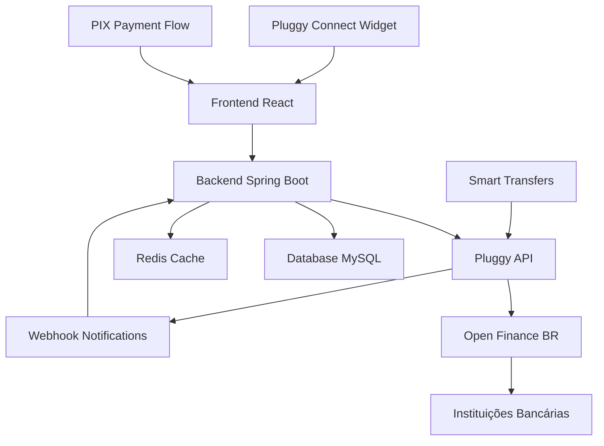

# Guia de Integração Open Banking - Finnantech V2

## 📋 Índice

1. [Visão Geral](#visão-geral)
2. [Provedores de Open Banking](#provedores-de-open-banking)
3. [Funcionalidades Disponíveis](#funcionalidades-disponíveis)
4. [Integração com Belvo](#integração-com-belvo)
5. [Fluxos de Autenticação](#fluxos-de-autenticação)
6. [APIs e Endpoints](#apis-e-endpoints)
7. [Implementação Técnica](#implementação-técnica)
8. [Segurança e Compliance](#segurança-e-compliance)
9. [Webhooks e Notificações](#webhooks-e-notificações)
10. [Próximos Passos](#próximos-passos)

---

## 🎯 Visão Geral

O Open Banking no Brasil permite que usuários conectem suas contas bancárias de forma segura ao sistema Finnantech, possibilitando:

- **Agregação de dados bancários** (contas, transações, saldos)
- **Iniciação de pagamentos** (PIX instantâneo e agendado)
- **Dados de emprego e FGTS**
- **Informações de cartão de crédito**
- **Investimentos e aplicações**

### Benefícios para o Usuário
- ✅ Visão unificada de todas as contas bancárias
- ✅ Categorização automática de transações
- ✅ Iniciação de pagamentos direto pelo app
- ✅ Análise inteligente de gastos
- ✅ Verificação automática de renda (FGTS/INSS)

---

## 🏢 Provedores de Open Banking

### 1. Pluggy (Recomendado Principal)
- **Website**: [docs.pluggy.ai](https://docs.pluggy.ai/)
- **Cobertura**: 180+ instituições brasileiras
- **Funcionalidades**: Banking, Payments, PIX, Smart Transfers, Employment
- **Certificação**: Banco Central do Brasil (Open Finance + PIX)
- **Ambiente**: Sandbox + Produção
- **Conectores**: Open Finance Regulamentado + Conectores Diretos
- **Diferencial**: Widget de conexão nativo + APIs de enriquecimento

### 2. OpenPix (PIX Especializado)
- **Website**: [developers.openpix.com.br](https://developers.openpix.com.br/)
- **Cobertura**: PIX e pagamentos instantâneos
- **Funcionalidades**: Charges, QR Codes, Webhooks, Subcontas
- **Certificação**: Banco Central (PIX)
- **Ambiente**: Sandbox + Produção

### 3. Belvo (Alternativo)
- **Website**: [developers.belvo.com](https://developers.belvo.com/)
- **Cobertura**: América Latina (foco México/Colômbia)
- **Funcionalidades**: Banking, Payments, Employment
- **Foco**: Mercado internacional

### 4. APIs Diretas (Bancos)
- **Nubank**: API própria
- **Inter**: Open Banking nativo
- **C6 Bank**: API disponível

---

## 🚀 Funcionalidades Disponíveis

### 📊 Banking Data (Dados Bancários)
```javascript
// Tipos de dados disponíveis
{
  "accounts": {
    "checking": "Conta corrente",
    "savings": "Poupança", 
    "creditCard": "Cartão de crédito",
    "loan": "Empréstimos",
    "investment": "Investimentos"
  },
  "transactions": {
    "period": "Últimos 12 meses",
    "categories": "Categorização automática",
    "merchant": "Dados do estabelecimento"
  },
  "balances": {
    "current": "Saldo atual",
    "available": "Saldo disponível",
    "blocked": "Valores bloqueados"
  }
}
```

### 💳 Payment Initiation (PIX)
```javascript
// Tipos de pagamento
{
  "pixImediato": {
    "method": "PIX_COB",
    "redirectFlow": "Open Finance",
    "maxAmount": "Sem limite",
    "status": ["CREATED", "REQUIRES_ACTION", "PROCESSING", "SUCCEEDED", "FAILED"]
  },
  "pixAgendado": {
    "method": "Scheduled PIX", 
    "futureDate": "Até 365 dias",
    "recurring": "Recorrência disponível",
    "ajusteDiaUtil": true
  },
  "pixRecorrente": {
    "frequency": ["WEEKLY", "MONTHLY", "QUARTERLY"],
    "endDate": "Data de encerramento",
    "politicaRetentativa": ["NAO_PERMITE", "PERMITE_3R_7D"]
  },
  "qrCodeDinamico": {
    "expiration": "Configurável",
    "brCode": "BR Code gerado automaticamente",
    "image": "QR Code como imagem ou base64"
  }
}
```

### 👨‍💼 Employment Data (FGTS/INSS)
```javascript
// Dados de emprego
{
  "inss": {
    "employer": "Empresa atual",
    "salary": "Salário histórico",
    "contributions": "Contribuições"
  },
  "fgts": {
    "balance": "Saldo FGTS",
    "deposits": "Depósitos mensais",
    "withdrawals": "Saques realizados"
  }
}
```

### PIX e QR Code Endpoints

#### 1. Criar Cobrança PIX
```java
@PostMapping("/pix/charge")
public ResponseEntity<ApiResponse<PixChargeResponse>> createPixCharge(
        @Valid @RequestBody CreatePixChargeRequest request,
        @AuthenticationPrincipal UserDetails user) {
    
    try {
        // Usando OpenPix para cobrança PIX
        PixCharge charge = openPixService.createCharge(request);
        
        PixChargeResponse response = PixChargeResponse.builder()
            .chargeId(charge.getId())
            .correlationId(charge.getCorrelationId())
            .brCode(charge.getBrCode())
            .qrCodeImage(charge.getQrCodeImage())
            .paymentUrl(charge.getPaymentUrl())
            .expiresAt(charge.getExpiresAt())
            .status(charge.getStatus())
            .build();
            
        return ResponseEntity.ok(ApiResponse.success(response));
        
    } catch (OpenPixException e) {
        return ResponseEntity.badRequest()
            .body(ApiResponse.error("Erro ao criar cobrança PIX: " + e.getMessage()));
    }
}
```

#### 2. QR Code Estático
```java
@PostMapping("/pix/qrcode-static")
public ResponseEntity<ApiResponse<QrCodeStaticResponse>> createStaticQrCode(
        @Valid @RequestBody CreateQrCodeRequest request,
        @AuthenticationPrincipal UserDetails user) {
    
    QrCodeStatic qrCode = openPixService.createStaticQrCode(
        request.getName(),
        request.getValue(),
        request.getComment()
    );
    
    return ResponseEntity.ok(ApiResponse.success(
        qrCodeMapper.toResponse(qrCode)));
}
```

#### 3. Consultar Status de Pagamento
```java
@GetMapping("/pix/charge/{chargeId}")
public ResponseEntity<ApiResponse<PixChargeStatusResponse>> getChargeStatus(
        @PathVariable String chargeId,
        @AuthenticationPrincipal UserDetails user) {
    
    PixCharge charge = openPixService.getCharge(chargeId);
    
    PixChargeStatusResponse response = PixChargeStatusResponse.builder()
        .chargeId(charge.getId())
        .status(charge.getStatus())
        .paidAt(charge.getPaidAt())
        .paidAmount(charge.getPaidAmount())
        .customer(charge.getCustomer())
        .build();
        
    return ResponseEntity.ok(ApiResponse.success(response));
}
```

#### 4. Estorno/Reembolso PIX
```java
@PostMapping("/pix/refund")
public ResponseEntity<ApiResponse<RefundResponse>> createRefund(
        @Valid @RequestBody CreateRefundRequest request,
        @AuthenticationPrincipal UserDetails user) {
    
    Refund refund = openPixService.createRefund(
        request.getTransactionEndToEndId(),
        request.getAmount(),
        request.getComment()
    );
    
    return ResponseEntity.ok(ApiResponse.success(
        refundMapper.toResponse(refund)));
}
```

---

## 🔧 Integração com Pluggy

### Configuração Inicial

#### 1. Credenciais API
```yaml
# .env
PLUGGY_CLIENT_ID=your_client_id
PLUGGY_CLIENT_SECRET=your_client_secret
PLUGGY_BASE_URL=https://api.pluggy.ai
PLUGGY_SANDBOX_URL=https://sandbox.pluggy.ai
```

#### 2. SDK Installation
```bash
# Backend Java - HTTP Client próprio (REST Template/WebClient)
# Não há SDK oficial Java - usar REST API

# Frontend JavaScript
npm install @pluggy/connect-widget
npm install axios
```

#### 3. Configuração do Cliente HTTP
```java
@Configuration
public class PluggyConfig {
    
    @Value("${pluggy.client-id}")
    private String clientId;
    
    @Value("${pluggy.client-secret}")
    private String clientSecret;
    
    @Value("${pluggy.base-url}")
    private String baseUrl;
    
    @Bean
    public PluggyClient pluggyClient() {
        return PluggyClient.builder()
            .clientId(clientId)
            .clientSecret(clientSecret)
            .baseUrl(baseUrl)
            .build();
    }
    
    @Bean
    public RestTemplate pluggyRestTemplate() {
        RestTemplate restTemplate = new RestTemplate();
        
        // Interceptor para autenticação
        restTemplate.getInterceptors().add((request, body, execution) -> {
            String apiKey = pluggyAuthService.getApiKey();
            request.getHeaders().add("Authorization", "Bearer " + apiKey);
            request.getHeaders().add("Content-Type", "application/json");
            return execution.execute(request, body);
        });
        
        return restTemplate;
    }
}
```

#### 4. Serviço de Autenticação Pluggy
```java
@Service
public class PluggyAuthService {
    
    @Value("${pluggy.client-id}")
    private String clientId;
    
    @Value("${pluggy.client-secret}")
    private String clientSecret;
    
    @Autowired
    private RestTemplate restTemplate;
    
    @Autowired
    private RedisTemplate<String, String> redisTemplate;
    
    /**
     * Obtém API Key para chamadas backend (válida por 2 horas)
     */
    public String getApiKey() {
        String cacheKey = "pluggy:api_key";
        String cachedKey = redisTemplate.opsForValue().get(cacheKey);
        
        if (cachedKey != null) {
            return cachedKey;
        }
        
        // Criar nova API Key
        CreateApiKeyRequest request = CreateApiKeyRequest.builder()
            .clientId(clientId)
            .clientSecret(clientSecret)
            .build();
            
        CreateApiKeyResponse response = restTemplate.postForObject(
            "/auth/api-keys", request, CreateApiKeyResponse.class);
            
        // Cache por 110 minutos (API Key válida por 120 min)
        redisTemplate.opsForValue().set(cacheKey, response.getApiKey(), 
            Duration.ofMinutes(110));
            
        return response.getApiKey();
    }
    
    /**
     * Cria Connect Token para o widget frontend (válido por 30 min)
     */
    public String createConnectToken(String userId) {
        CreateConnectTokenRequest request = CreateConnectTokenRequest.builder()
            .clientUserId(userId)
            .build();
            
        CreateConnectTokenResponse response = restTemplate.postForObject(
            "/auth/connect-tokens", request, CreateConnectTokenResponse.class);
            
        return response.getConnectToken();
    }
}
```

### APIs PIX Complementares (OpenPix)
```bash
# Instalar SDK OpenPix para funcionalidades PIX avançadas
npm install @openpix/sdk

# Configuração adicional
OPENPIX_APP_ID=your_app_id
OPENPIX_BASE_URL=https://api.openpix.com.br
OPENPIX_SANDBOX_URL=https://api.woovi-sandbox.com
```

### Arquitetura de Integração



---

## 🔐 Fluxos de Autenticação

### 1. Connection Flow (Widget)
```javascript
// Frontend - Pluggy Connect Widget
const PluggyConnectWidget = () => {
  const config = {
    connectToken: PLUGGY_CONNECT_TOKEN,
    onSuccess: (item) => {
      // Conexão bem-sucedida
      saveConnection(item);
    },
    onError: (error) => {
      // Erro na conexão
      handleConnectionError(error);
    },
    onExit: (data) => {
      // Usuário cancelou conexão
      handleConnectionCancel(data);
    },
    onEvent: (event) => {
      // Eventos do widget
      trackWidgetEvent(event);
    },
    products: ['ACCOUNTS', 'TRANSACTIONS', 'IDENTITY', 'CREDIT_CARDS']
  };
  
  return (
    <PluggyConnect 
      connectToken={PLUGGY_CONNECT_TOKEN}
      onSuccess={config.onSuccess}
      onError={config.onError}
      onExit={config.onExit}
      products={config.products}
      includeSandbox={process.env.NODE_ENV === 'development'}
    />
  );
};
```

### 2. Backend Connection Handler
```java
@RestController
@RequestMapping("/api/v1/banking")
public class BankingController {
    
    @Autowired
    private PluggyService pluggyService;
    
    @PostMapping("/connect-token")
    public ResponseEntity<ApiResponse<ConnectTokenResponse>> createConnectToken(
            @AuthenticationPrincipal UserDetails user) {
        
        try {
            // Criar connect token para o widget
            ConnectTokenResponse token = pluggyService.createConnectToken(user.getUsername());
            
            return ResponseEntity.ok(ApiResponse.success(token));
            
        } catch (PluggyException e) {
            return ResponseEntity.badRequest()
                .body(ApiResponse.error("Erro ao criar token de conexão: " + e.getMessage()));
        }
    }
    
    @PostMapping("/items")
    public ResponseEntity<ApiResponse<ItemResponse>> createItem(
            @RequestBody CreateItemRequest request,
            @AuthenticationPrincipal UserDetails user) {
        
        try {
            // Criar item (conexão) com a instituição
            ItemResponse item = pluggyService.createItem(request, user.getUsername());
            
            // Salvar conexão no banco
            bankingConnectionService.saveConnection(item, user.getUsername());
            
            return ResponseEntity.ok(ApiResponse.success(item));
            
        } catch (PluggyException e) {
            return ResponseEntity.badRequest()
                .body(ApiResponse.error("Erro na conexão bancária: " + e.getMessage()));
        }
    }
}
```

### 3. PIX Payments Flow (Pluggy)
```java
@Service
public class PluggyPixPaymentService {
    
    @Autowired
    private PluggyClient pluggyClient;
    
    /**
     * Criar intenção de pagamento PIX
     */
    public PaymentIntentResponse createPixPaymentIntent(CreatePixRequest request) {
        PaymentIntentPayload payload = PaymentIntentPayload.builder()
            .amount(request.getAmount())
            .description(request.getDescription())
            .recipient(PaymentRecipient.builder()
                .name(request.getRecipient().getName())
                .taxId(request.getRecipient().getTaxId())
                .bankAccount(BankAccount.builder()
                    .bankCode(request.getRecipient().getBankCode())
                    .branch(request.getRecipient().getBranch())
                    .account(request.getRecipient().getAccount())
                    .accountType(request.getRecipient().getAccountType())
                    .build())
                .build())
            .customer(request.getCustomerId())
            .callbackUrl(request.getCallbackUrl())
            .build();
            
        return pluggyClient.paymentIntents().create(payload);
    }
    
    /**
     * Criar PIX QR Code
     */
    public QrCodePixResponse createPixQrCode(CreatePixQrRequest request) {
        QrCodePixPayload payload = QrCodePixPayload.builder()
            .amount(request.getAmount())
            .description(request.getDescription())
            .expirationDate(request.getExpirationDate())
            .build();
            
        return pluggyClient.payments().createPixQrCode(payload);
    }
    
    /**
     * Agendar pagamento PIX
     */
    public ScheduledPaymentResponse schedulePixPayment(SchedulePixRequest request) {
        ScheduledPaymentPayload payload = ScheduledPaymentPayload.builder()
            .amount(request.getAmount())
            .description(request.getDescription())
            .scheduledDate(request.getScheduledDate())
            .frequency(request.getFrequency()) // ONCE, WEEKLY, MONTHLY
            .endDate(request.getEndDate())
            .recipient(request.getRecipient())
            .customer(request.getCustomerId())
            .build();
            
        return pluggyClient.scheduledPayments().create(payload);
    }
    
    /**
     * Smart Transfer (pagamento entre contas do mesmo CPF/CNPJ)
     */
    public SmartTransferResponse createSmartTransfer(SmartTransferRequest request) {
        // 1. Criar pré-autorização
        PreauthorizationPayload preauth = PreauthorizationPayload.builder()
            .debtorAccountId(request.getDebtorAccountId())
            .allowedRecipients(request.getAllowedRecipients())
            .maxAmount(request.getMaxAmount())
            .expirationDate(LocalDate.now().plusDays(30))
            .build();
            
        PreauthorizationResponse preauthResponse = pluggyClient
            .smartTransfers().createPreauthorization(preauth);
            
        // 2. Criar pagamento usando pré-autorização
        SmartTransferPayload payment = SmartTransferPayload.builder()
            .preauthorizationId(preauthResponse.getId())
            .amount(request.getAmount())
            .description(request.getDescription())
            .recipientAccountId(request.getRecipientAccountId())
            .build();
            
        return pluggyClient.smartTransfers().createPayment(payment);
    }
}
```

---

## 📡 APIs e Endpoints

### Banking Data Endpoints

#### 1. Contas Bancárias
```java
@GetMapping("/accounts")
public ResponseEntity<ApiResponse<List<AccountResponse>>> getAccounts(
        @AuthenticationPrincipal UserDetails user) {
    
    List<Account> accounts = pluggyService.getAccounts(user.getUsername());
    List<AccountResponse> response = accounts.stream()
        .map(accountMapper::toResponse)
        .collect(Collectors.toList());
        
    return ResponseEntity.ok(ApiResponse.success(response));
}
```

#### 2. Transações
```java
@GetMapping("/transactions")
public ResponseEntity<ApiResponse<List<TransactionResponse>>> getTransactions(
        @AuthenticationPrincipal UserDetails user,
        @RequestParam(required = false) String accountId,
        @RequestParam(required = false) LocalDate startDate,
        @RequestParam(required = false) LocalDate endDate) {
    
    TransactionFilter filter = TransactionFilter.builder()
        .accountId(accountId)
        .startDate(startDate)
        .endDate(endDate)
        .build();
        
            List<Transaction> transactions = pluggyService.getTransactions(
        user.getUsername(), filter);
        
    return ResponseEntity.ok(ApiResponse.success(
        transactions.stream()
            .map(transactionMapper::toResponse)
            .collect(Collectors.toList())
    ));
}
```

#### 3. Saldos
```java
@GetMapping("/balances")
public ResponseEntity<ApiResponse<List<BalanceResponse>>> getBalances(
        @AuthenticationPrincipal UserDetails user) {
    
    List<Balance> balances = pluggyService.getBalances(user.getUsername());
    
    return ResponseEntity.ok(ApiResponse.success(
        balances.stream()
            .map(balanceMapper::toResponse)
            .collect(Collectors.toList())
    ));
}
```

### Payment Initiation Endpoints

#### 1. Criar PIX
```java
@PostMapping("/pix/create")
public ResponseEntity<ApiResponse<PixResponse>> createPix(
        @Valid @RequestBody CreatePixRequest request,
        @AuthenticationPrincipal UserDetails user) {
    
    PaymentIntent intent = pixPaymentService.createPixPayment(request);
    
    PixResponse response = PixResponse.builder()
        .paymentIntentId(intent.getId())
        .redirectUrl(intent.getPaymentMethodInformation()
            .getOpenFinance().getRedirectUrl())
        .status(intent.getStatus())
        .build();
        
    return ResponseEntity.ok(ApiResponse.success(response));
}
```

#### 2. PIX Agendado
```java
@PostMapping("/pix/schedule")
public ResponseEntity<ApiResponse<ScheduledPixResponse>> schedulePixPayment(
        @Valid @RequestBody SchedulePixRequest request,
        @AuthenticationPrincipal UserDetails user) {
    
    ScheduledPayment payment = pixPaymentService.schedulePixPayment(request);
    
    return ResponseEntity.ok(ApiResponse.success(
        scheduledPixMapper.toResponse(payment)));
}
```

### Employment Data Endpoints

#### 1. Dados FGTS
```java
@GetMapping("/employment/fgts")
public ResponseEntity<ApiResponse<FgtsResponse>> getFgtsData(
        @AuthenticationPrincipal UserDetails user) {
    
    Employment employment = pluggyService.getEmploymentData(user.getUsername());
    
    return ResponseEntity.ok(ApiResponse.success(
        fgtsMapper.toResponse(employment)));
}
```

---

## 💰 Custos e Comparação de Provedores

### Pluggy (Recomendado)
- **Setup**: Gratuito
- **Sandbox**: Ilimitado e gratuito
- **Produção**: 
  - Conexões: R$ 0,50 por conexão ativa/mês
  - Transações: R$ 0,02 por transação sincronizada
  - PIX: R$ 0,30 por pagamento iniciado
  - Smart Transfers: R$ 0,15 por transferência
- **Limite de Rate**: Seguindo Open Finance BR
- **Cobertura**: 180+ instituições brasileiras
- **Diferencial**: Open Finance regulamentado + conectores diretos

### OpenPix (PIX Especializado)
- **Setup**: Gratuito
- **PIX**: 0,99% por transação
- **QR Code**: Gratuito
- **Webhooks**: Gratuitos
- **Foco**: Apenas PIX e pagamentos

### Belvo (Internacional)
- **Setup**: USD 100/mês
- **Conexões**: USD 2,00 por conexão/mês
- **Transações**: USD 0,05 por sincronização
- **Pagamentos**: USD 1,00 por PIX
- **Foco**: América Latina (México, Colômbia)

### Estimativa de Custo Mensal (1.000 usuários ativos)
```
Pluggy:
- 1.000 conexões × R$ 0,50 = R$ 500,00
- 10.000 transações × R$ 0,02 = R$ 200,00
- 500 PIX × R$ 0,30 = R$ 150,00
- Total: R$ 850,00/mês

OpenPix (apenas PIX):
- 500 PIX × 0,99% × R$ 50 (valor médio) = R$ 247,50/mês

Belvo:
- Base: USD 100 = R$ 500,00
- 1.000 conexões × USD 2,00 = USD 2.000 = R$ 10.000,00
- Total: R$ 10.500,00/mês
```

---

## ⚙️ Implementação Técnica

### 1. Service Layer
```java
@Service
@Transactional
public class PluggyService {
    
    private final PluggyClient pluggyClient;
    private final BankingConnectionRepository connectionRepository;
    
    public List<Account> getAccounts(String userId) {
        BankingConnection connection = connectionRepository
            .findByUserIdAndActiveTrue(userId)
            .orElseThrow(() -> new BankingConnectionNotFoundException());
            
        return pluggyClient.accounts()
            .list(connection.getItemId())
            .stream()
            .map(this::convertToDomainAccount)
            .collect(Collectors.toList());
    }
    
    public List<Transaction> getTransactions(String userId, TransactionFilter filter) {
        BankingConnection connection = getActiveConnection(userId);
        
        // Cache key para transações
        String cacheKey = "transactions:" + userId + ":" + filter.hashCode();
        
        return redisTemplate.opsForValue().get(cacheKey, List.class)
            .orElseGet(() -> {
                List<Transaction> transactions = pluggyClient.transactions()
                    .list(connection.getItemId(), filter.toMap());
                    
                // Cache por 5 minutos
                redisTemplate.opsForValue().set(cacheKey, transactions, 
                    Duration.ofMinutes(5));
                    
                return transactions;
            });
    }
    
    @Async
    public CompletableFuture<Void> syncTransactions(String userId) {
        try {
            List<Transaction> transactions = getTransactions(userId, 
                TransactionFilter.lastMonth());
                
            transactionService.saveTransactions(userId, transactions);
            
            // Webhook para frontend
            notificationService.notifyTransactionSync(userId, transactions.size());
            
        } catch (Exception e) {
            log.error("Erro na sincronização de transações para usuário {}", userId, e);
        }
        
        return CompletableFuture.completedFuture(null);
    }
    
    /**
     * Criar Item (conexão com instituição financeira)
     */
    public ItemResponse createItem(CreateItemRequest request, String userId) {
        CreateItemPayload payload = CreateItemPayload.builder()
            .connectorId(request.getConnectorId())
            .credentials(request.getCredentials())
            .userAction(request.getUserAction())
            .products(request.getProducts()) // ACCOUNTS, TRANSACTIONS, CREDIT_CARDS, etc.
            .webhookUrl(applicationProperties.getWebhookUrl() + "/pluggy")
            .build();
            
        ItemResponse response = pluggyClient.items().create(payload);
        
        // Salvar no banco de dados local
        BankingConnection connection = BankingConnection.builder()
            .itemId(response.getId())
            .userId(userId)
            .connectorId(response.getConnector().getId())
            .connectorName(response.getConnector().getName())
            .status(response.getStatus())
            .products(response.getProducts())
            .lastSyncAt(response.getLastUpdatedAt())
            .active(true)
            .build();
            
        return connectionRepository.save(connection);
    }
    
    /**
     * Atualizar Item existente (MFA, credenciais)
     */
    public ItemResponse updateItem(String itemId, UpdateItemRequest request) {
        UpdateItemPayload payload = UpdateItemPayload.builder()
            .credentials(request.getCredentials())
            .userAction(request.getUserAction())
            .build();
            
        return pluggyClient.items().update(itemId, payload);
    }
    
    /**
     * Listar conectores disponíveis
     */
    public List<ConnectorResponse> getConnectors(boolean includeOpenFinance) {
        String cacheKey = "pluggy:connectors:" + includeOpenFinance;
        List<ConnectorResponse> cached = (List<ConnectorResponse>) redisTemplate
            .opsForValue().get(cacheKey);
            
        if (cached != null) {
            return cached;
        }
        
        List<ConnectorResponse> connectors = pluggyClient.connectors()
            .list(ConnectorFilter.builder()
                .isOpenFinance(includeOpenFinance)
                .build());
                
        // Cache por 1 hora
        redisTemplate.opsForValue().set(cacheKey, connectors, Duration.ofHours(1));
        
        return connectors;
    }
}
```

### 2. OpenPix Service Layer
```java
@Service
@Transactional
public class OpenPixService {
    
    private final OpenPixClient openPixClient;
    private final PixChargeRepository pixChargeRepository;
    private final RedisTemplate<String, Object> redisTemplate;
    
    public PixCharge createCharge(CreatePixChargeRequest request) {
        PixChargePayload payload = PixChargePayload.builder()
            .correlationID(request.getCorrelationId())
            .value(request.getAmount()) // em centavos
            .comment(request.getDescription())
            .customer(Customer.builder()
                .name(request.getCustomer().getName())
                .taxID(request.getCustomer().getTaxId())
                .email(request.getCustomer().getEmail())
                .phone(request.getCustomer().getPhone())
                .build())
            .additionalInfo(request.getAdditionalInfo())
            .expiresIn(request.getExpiresIn())
            .build();
            
        PixChargeResponse response = openPixClient.charges().create(payload);
        
        // Salvar no banco local
        PixCharge charge = pixChargeMapper.toDomain(response);
        return pixChargeRepository.save(charge);
    }
    
    public QrCodeStatic createStaticQrCode(String name, Integer value, String comment) {
        QrCodeStaticPayload payload = QrCodeStaticPayload.builder()
            .name(name)
            .correlationID(UUID.randomUUID().toString())
            .value(value)
            .comment(comment)
            .build();
            
        return openPixClient.qrCodeStatic().create(payload);
    }
    
    public PaymentTransaction getPaymentTransaction(String endToEndId) {
        // Cache primeiro
        String cacheKey = "payment_transaction:" + endToEndId;
        PaymentTransaction cached = (PaymentTransaction) redisTemplate
            .opsForValue().get(cacheKey);
            
        if (cached != null) {
            return cached;
        }
        
        PaymentTransaction transaction = openPixClient.transactions().get(endToEndId);
        
        // Cache por 1 hora
        redisTemplate.opsForValue().set(cacheKey, transaction, Duration.ofHours(1));
        
        return transaction;
    }
    
    @Async
    public CompletableFuture<Void> processWebhookEvent(WebhookEvent event) {
        try {
            switch (event.getEvent()) {
                case "OPENPIX:CHARGE_COMPLETED":
                    handleChargeCompleted(event);
                    break;
                case "OPENPIX:TRANSACTION_RECEIVED":
                    handleTransactionReceived(event);
                    break;
                case "OPENPIX:TRANSACTION_REFUND_RECEIVED":
                    handleRefundReceived(event);
                    break;
            }
        } catch (Exception e) {
            log.error("Erro no processamento de webhook PIX", e);
        }
        
        return CompletableFuture.completedFuture(null);
    }
    
    private void handleChargeCompleted(WebhookEvent event) {
        PixCharge charge = event.getCharge();
        
        // Atualizar status no banco
        pixChargeRepository.updateStatus(charge.getCorrelationID(), "COMPLETED");
        
        // Notificar usuário
        notificationService.sendPaymentNotification(
            charge.getUserId(),
            "Pagamento PIX recebido: R$ " + formatCurrency(charge.getValue())
        );
        
        // Webhook para frontend
        websocketService.sendToUser(
            charge.getUserId(),
            "/queue/payments",
            PaymentNotification.completed(charge)
        );
    }
}
```

### 3. Webhook Configuration for PIX
```java
@Configuration
@EnableConfigurationProperties(WebhookProperties.class)
public class PixWebhookConfig {
    
    @Bean
    public PixWebhookValidator pixWebhookValidator(WebhookProperties properties) {
        return new PixWebhookValidator(properties.getOpenPixSecret());
    }
    
    @Bean
    @ConditionalOnProperty(value = "openpix.webhook.auto-register", havingValue = "true")
    public CommandLineRunner registerPixWebhooks(OpenPixService openPixService) {
        return args -> {
            // Registrar webhooks automaticamente
            registerWebhook("OPENPIX:CHARGE_COMPLETED", "/webhooks/openpix/charge-completed");
            registerWebhook("OPENPIX:TRANSACTION_RECEIVED", "/webhooks/openpix/transaction-received");
            registerWebhook("OPENPIX:TRANSACTION_REFUND_RECEIVED", "/webhooks/openpix/refund-received");
        };
    }
    
    private void registerWebhook(String event, String endpoint) {
        WebhookRegistration webhook = WebhookRegistration.builder()
            .name("Finnantech " + event)
            .event(event)
            .url(applicationProperties.getBaseUrl() + endpoint)
            .authorization(webhookProperties.getAuthToken())
            .isActive(true)
            .build();
            
        openPixService.registerWebhook(webhook);
    }
}
```

### 4. PIX Data Models
```java
@Entity
@Table(name = "pix_charges")
public class PixCharge {
    
    @Id
    private String id;
    
    @Column(name = "user_id", nullable = false)
    private String userId;
    
    @Column(name = "correlation_id", unique = true, nullable = false)
    private String correlationId;
    
    @Column(name = "external_id")
    private String externalId; // ID da OpenPix
    
    @Column(name = "amount", nullable = false)
    private BigDecimal amount;
    
    @Column(name = "description")
    private String description;
    
    @Column(name = "status", nullable = false)
    @Enumerated(EnumType.STRING)
    private PixChargeStatus status;
    
    @Column(name = "br_code", columnDefinition = "TEXT")
    private String brCode;
    
    @Column(name = "qr_code_image_url")
    private String qrCodeImageUrl;
    
    @Column(name = "payment_url")
    private String paymentUrl;
    
    @Column(name = "expires_at")
    private LocalDateTime expiresAt;
    
    @Column(name = "paid_at")
    private LocalDateTime paidAt;
    
    @Column(name = "customer_data", columnDefinition = "JSON")
    private String customerData;
    
    @Column(name = "additional_info", columnDefinition = "JSON")
    private String additionalInfo;
    
    @CreationTimestamp
    private LocalDateTime createdAt;
    
    @UpdateTimestamp
    private LocalDateTime updatedAt;
    
    // getters, setters, builders
}

public enum PixChargeStatus {
    ACTIVE, COMPLETED, EXPIRED, CANCELLED
}

@Entity
@Table(name = "pix_transactions")
public class PixTransaction {
    
    @Id
    private String id;
    
    @Column(name = "charge_id")
    private String chargeId;
    
    @Column(name = "end_to_end_id", unique = true)
    private String endToEndId;
    
    @Column(name = "amount", nullable = false)
    private BigDecimal amount;
    
    @Column(name = "payer_name")
    private String payerName;
    
    @Column(name = "payer_tax_id")
    private String payerTaxId;
    
    @Column(name = "transaction_type")
    @Enumerated(EnumType.STRING)
    private PixTransactionType type; // PAYMENT, REFUND
    
    @Column(name = "info_pagador")
    private String infoPagador;
    
    @Column(name = "raw_data", columnDefinition = "JSON")
    private String rawData;
    
    @CreationTimestamp
    private LocalDateTime createdAt;
    
    // getters, setters, builders
}
```

### 5. Data Models
```java
@Entity
@Table(name = "banking_connections")
public class BankingConnection {
    
    @Id
    private String id;
    
    @Column(name = "user_id", nullable = false)
    private String userId;
    
    @Column(name = "institution_id", nullable = false)
    private String institutionId;
    
    @Column(name = "institution_name")
    private String institutionName;
    
    @Column(name = "link_id", nullable = false)
    private String linkId;
    
    @Column(name = "access_mode")
    @Enumerated(EnumType.STRING)
    private AccessMode accessMode;
    
    @Column(name = "status")
    @Enumerated(EnumType.STRING)
    private ConnectionStatus status;
    
    @Column(name = "last_sync")
    private LocalDateTime lastSync;
    
    @Column(name = "expires_at")
    private LocalDateTime expiresAt;
    
    @Column(name = "created_at")
    private LocalDateTime createdAt;
    
    // getters, setters, builders
}

public enum AccessMode {
    SINGLE, RECURRENT
}

public enum ConnectionStatus {
    VALID, INVALID, UNCONFIRMED, TOKEN_REFRESH
}
```

### 6. Configuration
```java
@Configuration
@EnableConfigurationProperties(BelvoProperties.class)
public class BelvoConfig {
    
    @Bean
    public BelvoClient belvoClient(BelvoProperties properties) {
        return BelvoClient.builder()
            .secretId(properties.getSecretId())
            .secretPassword(properties.getSecretPassword())
            .baseUrl(properties.getBaseUrl())
            .timeout(Duration.ofSeconds(30))
            .build();
    }
    
    @Bean
    public TaskExecutor bankingSyncExecutor() {
        ThreadPoolTaskExecutor executor = new ThreadPoolTaskExecutor();
        executor.setCorePoolSize(2);
        executor.setMaxPoolSize(5);
        executor.setQueueCapacity(100);
        executor.setThreadNamePrefix("banking-sync-");
        executor.initialize();
        return executor;
    }
}

@ConfigurationProperties(prefix = "belvo")
@Data
public class BelvoProperties {
    private String secretId;
    private String secretPassword;
    private String baseUrl;
    private String webhookSecret;
    private boolean sandboxMode = false;
}
```

---

## 🔒 Segurança e Compliance

### 1. Criptografia de Dados
```java
@Component
public class BankingDataEncryption {
    
    @Value("${app.encryption.key}")
    private String encryptionKey;
    
    public String encryptSensitiveData(String data) {
        try {
            SecretKeySpec secretKey = new SecretKeySpec(
                encryptionKey.getBytes(), "AES");
                
            Cipher cipher = Cipher.getInstance("AES/CBC/PKCS5Padding");
            cipher.init(Cipher.ENCRYPT_MODE, secretKey);
            
            byte[] encrypted = cipher.doFinal(data.getBytes());
            return Base64.getEncoder().encodeToString(encrypted);
            
        } catch (Exception e) {
            throw new EncryptionException("Erro ao criptografar dados", e);
        }
    }
    
    public String decryptSensitiveData(String encryptedData) {
        // Implementação da descriptografia
    }
}
```

### 2. Auditoria e Logs
```java
@Component
public class BankingAuditLogger {
    
    @EventListener
    public void handleBankingConnectionEvent(BankingConnectionEvent event) {
        AuditLog log = AuditLog.builder()
            .userId(event.getUserId())
            .action(event.getAction())
            .resource("BANKING_CONNECTION")
            .details(event.getDetails())
            .ipAddress(event.getIpAddress())
            .userAgent(event.getUserAgent())
            .timestamp(LocalDateTime.now())
            .build();
            
        auditLogRepository.save(log);
    }
    
    @EventListener
    public void handlePaymentEvent(PaymentEvent event) {
        // Log de pagamentos para compliance
        PaymentAuditLog log = PaymentAuditLog.builder()
            .paymentId(event.getPaymentId())
            .amount(event.getAmount())
            .method("PIX")
            .status(event.getStatus())
            .build();
            
        paymentAuditRepository.save(log);
    }
}
```

### 3. Rate Limiting
```java
@Component
public class BankingRateLimiter {
    
    private final RedisTemplate<String, String> redisTemplate;
    
    @RateLimiter(name = "banking-api", fallbackMethod = "rateLimitFallback")
    public List<Transaction> getTransactionsWithRateLimit(String userId) {
        return belvoService.getTransactions(userId);
    }
    
    public List<Transaction> rateLimitFallback(String userId, Exception ex) {
        // Retornar dados em cache ou erro amigável
        return getCachedTransactions(userId);
    }
}
```

---

## 📩 Webhooks e Notificações

### 1. Webhook Handler
```java
@RestController
@RequestMapping("/webhooks/belvo")
public class BelvoWebhookController {
    
    @PostMapping("/transactions")
    public ResponseEntity<String> handleTransactionWebhook(
            @RequestBody String payload,
            @RequestHeader("Authorization") String signature) {
        
        // Verificar assinatura webhook
        if (!webhookValidator.isValidSignature(payload, signature)) {
            return ResponseEntity.status(HttpStatus.UNAUTHORIZED).build();
        }
        
        try {
            WebhookEvent event = objectMapper.readValue(payload, WebhookEvent.class);
            
            switch (event.getType()) {
                case "OBJECT_CREATED":
                    handleTransactionCreated(event);
                    break;
                case "STATUS_UPDATE":
                    handleTransactionStatusUpdate(event);
                    break;
            }
            
            return ResponseEntity.ok("OK");
            
        } catch (Exception e) {
            log.error("Erro no processamento do webhook", e);
            return ResponseEntity.status(HttpStatus.INTERNAL_SERVER_ERROR).build();
        }
    }
    
    private void handleTransactionCreated(WebhookEvent event) {
        // Processar nova transação
        asyncTransactionProcessor.processNewTransaction(event.getObjectId());
    }
}
```

### 2. PIX Webhook Handler (OpenPix)
```java
@RestController
@RequestMapping("/webhooks/openpix")
public class OpenPixWebhookController {
    
    @Autowired
    private OpenPixService openPixService;
    
    @Autowired
    private WebhookValidator webhookValidator;
    
    @PostMapping("/charge-completed")
    public ResponseEntity<String> handleChargeCompleted(
            @RequestBody String payload,
            @RequestHeader(value = "Authorization", required = false) String signature) {
        
        if (!webhookValidator.isValidOpenPixSignature(payload, signature)) {
            log.warn("Assinatura inválida no webhook PIX");
            return ResponseEntity.status(HttpStatus.UNAUTHORIZED).build();
        }
        
        try {
            PixWebhookEvent event = objectMapper.readValue(payload, PixWebhookEvent.class);
            
            // Processar pagamento confirmado
            openPixService.processChargeCompleted(event.getCharge());
            
            return ResponseEntity.ok("OK");
            
        } catch (Exception e) {
            log.error("Erro no processamento do webhook PIX", e);
            return ResponseEntity.status(HttpStatus.INTERNAL_SERVER_ERROR).build();
        }
    }
    
    @PostMapping("/transaction-received")
    public ResponseEntity<String> handleTransactionReceived(
            @RequestBody String payload,
            @RequestHeader(value = "Authorization", required = false) String signature) {
        
        try {
            PixTransactionWebhook event = objectMapper.readValue(payload, PixTransactionWebhook.class);
            
            // Processar transação PIX recebida
            openPixService.processTransactionReceived(event.getTransaction());
            
            return ResponseEntity.ok("OK");
            
        } catch (Exception e) {
            log.error("Erro no processamento de transação PIX", e);
            return ResponseEntity.status(HttpStatus.INTERNAL_SERVER_ERROR).build();
        }
    }
    
    @PostMapping("/refund-received")
    public ResponseEntity<String> handleRefundReceived(
            @RequestBody String payload) {
        
        try {
            PixRefundWebhook event = objectMapper.readValue(payload, PixRefundWebhook.class);
            
            // Processar estorno PIX
            openPixService.processRefundReceived(event.getRefund());
            
            return ResponseEntity.ok("OK");
            
        } catch (Exception e) {
            log.error("Erro no processamento de estorno PIX", e);
            return ResponseEntity.status(HttpStatus.INTERNAL_SERVER_ERROR).build();
        }
    }
}
```

### 3. Webhook Security Validator
```java
@Component
public class WebhookValidator {
    
    @Value("${belvo.webhook.secret}")
    private String belvoWebhookSecret;
    
    @Value("${openpix.webhook.secret}")
    private String openPixWebhookSecret;
    
    public boolean isValidSignature(String payload, String signature) {
        try {
            String expectedSignature = calculateHmacSha256(payload, belvoWebhookSecret);
            return MessageDigest.isEqual(
                signature.getBytes(StandardCharsets.UTF_8),
                expectedSignature.getBytes(StandardCharsets.UTF_8)
            );
        } catch (Exception e) {
            log.error("Erro na validação de assinatura", e);
            return false;
        }
    }
    
    public boolean isValidOpenPixSignature(String payload, String signature) {
        if (StringUtils.isEmpty(signature)) {
            // OpenPix pode não enviar assinatura em alguns casos
            return true; // Validar por IP whitelist
        }
        
        try {
            String expectedSignature = calculateHmacSha256(payload, openPixWebhookSecret);
            return MessageDigest.isEqual(
                signature.getBytes(StandardCharsets.UTF_8),
                expectedSignature.getBytes(StandardCharsets.UTF_8)
            );
        } catch (Exception e) {
            log.error("Erro na validação de assinatura OpenPix", e);
            return false;
        }
    }
    
    private String calculateHmacSha256(String data, String secret) {
        try {
            SecretKeySpec secretKeySpec = new SecretKeySpec(
                secret.getBytes(StandardCharsets.UTF_8), "HmacSHA256");
            Mac mac = Mac.getInstance("HmacSHA256");
            mac.init(secretKeySpec);
            
            byte[] hashBytes = mac.doFinal(data.getBytes(StandardCharsets.UTF_8));
            return Base64.getEncoder().encodeToString(hashBytes);
            
        } catch (Exception e) {
            throw new RuntimeException("Erro no cálculo HMAC", e);
        }
    }
}
```

### 4. Real-time Notifications
```java
@Service
public class RealTimeNotificationService {
    
    @Autowired
    private SimpMessagingTemplate messagingTemplate;
    
    @EventListener
    public void handleNewTransaction(TransactionCreatedEvent event) {
        TransactionNotification notification = TransactionNotification.builder()
            .transactionId(event.getTransactionId())
            .amount(event.getAmount())
            .description(event.getDescription())
            .timestamp(LocalDateTime.now())
            .build();
            
        // Enviar via WebSocket para o frontend
        messagingTemplate.convertAndSendToUser(
            event.getUserId(),
            "/queue/transactions",
            notification
        );
    }
}
```

---

## 🎨 Frontend Integration

### 1. React Hook para Banking
```typescript
// hooks/useBanking.ts
export const useBanking = () => {
  const [connections, setConnections] = useState<BankingConnection[]>([]);
  const [transactions, setTransactions] = useState<Transaction[]>([]);
  const [loading, setLoading] = useState(false);
  
  const connectBank = useCallback(async (institution: Institution) => {
    setLoading(true);
    try {
      const response = await bankingService.connectBank(institution);
      setConnections(prev => [...prev, response.data]);
      toast.success('Banco conectado com sucesso!');
    } catch (error) {
      toast.error('Erro ao conectar banco');
    } finally {
      setLoading(false);
    }
  }, []);
  
  const syncTransactions = useCallback(async () => {
    setLoading(true);
    try {
      const response = await bankingService.syncTransactions();
      setTransactions(response.data);
    } catch (error) {
      toast.error('Erro na sincronização');
    } finally {
      setLoading(false);
    }
  }, []);
  
  return {
    connections,
    transactions,
    loading,
    connectBank,
    syncTransactions
  };
};
```

### 2. Banking Connection Component
```typescript
// components/BankingConnection.tsx
const BankingConnection: React.FC = () => {
  const { connectBank, connections, loading } = useBanking();
  const [showWidget, setShowWidget] = useState(false);
  
  const handleBankSelection = (institution: Institution) => {
    setShowWidget(true);
    // Belvo Widget será mostrado
  };
  
  return (
    <Card className="p-6">
      <h2 className="text-xl font-semibold mb-4">Conectar Conta Bancária</h2>
      
      <div className="grid grid-cols-1 md:grid-cols-2 lg:grid-cols-3 gap-4">
        {SUPPORTED_BANKS.map(bank => (
          <BankCard
            key={bank.id}
            bank={bank}
            onSelect={() => handleBankSelection(bank)}
            connected={connections.some(c => c.institutionId === bank.id)}
          />
        ))}
      </div>
      
      {showWidget && (
        <BelvoWidget
          onSuccess={(connection) => {
            setConnections(prev => [...prev, connection]);
            setShowWidget(false);
          }}
          onClose={() => setShowWidget(false)}
        />
      )}
    </Card>
  );
};
```

### 3. PIX Payment Component
```typescript
// components/PixPayment.tsx
const PixPayment: React.FC = () => {
  const { createPixPayment } = usePayments();
  const [formData, setFormData] = useState<PixPaymentForm>();
  
  const handleSubmit = async (data: PixPaymentForm) => {
    try {
      const payment = await createPixPayment(data);
      
      // Redirecionar para autorização
      window.location.href = payment.redirectUrl;
      
    } catch (error) {
      toast.error('Erro ao criar pagamento PIX');
    }
  };
  
  return (
    <Form onSubmit={handleSubmit}>
      <FormField name="amount" label="Valor" type="currency" required />
      <FormField name="pixKey" label="Chave PIX" required />
      <FormField name="description" label="Descrição" />
      
      <Button type="submit" className="w-full">
        Pagar com PIX
      </Button>
    </Form>
  );
};
```

---

## 📊 Database Schema

### Banking Tables
```sql
-- Conexões bancárias
CREATE TABLE banking_connections (
    id VARCHAR(36) PRIMARY KEY,
    user_id VARCHAR(36) NOT NULL,
    institution_id VARCHAR(100) NOT NULL,
    institution_name VARCHAR(255),
    link_id VARCHAR(255) NOT NULL,
    access_mode ENUM('SINGLE', 'RECURRENT') DEFAULT 'RECURRENT',
    status ENUM('VALID', 'INVALID', 'UNCONFIRMED', 'TOKEN_REFRESH') DEFAULT 'VALID',
    last_sync TIMESTAMP NULL,
    expires_at TIMESTAMP NULL,
    created_at TIMESTAMP DEFAULT CURRENT_TIMESTAMP,
    updated_at TIMESTAMP DEFAULT CURRENT_TIMESTAMP ON UPDATE CURRENT_TIMESTAMP,
    
    INDEX idx_user_id (user_id),
    INDEX idx_institution_id (institution_id),
    FOREIGN KEY (user_id) REFERENCES users(id) ON DELETE CASCADE
);

-- Contas bancárias
CREATE TABLE bank_accounts (
    id VARCHAR(36) PRIMARY KEY,
    connection_id VARCHAR(36) NOT NULL,
    external_id VARCHAR(255) NOT NULL,
    name VARCHAR(255),
    official_name VARCHAR(255),
    type ENUM('checking', 'savings', 'credit_card', 'loan', 'investment'),
    balance_available DECIMAL(15,2),
    balance_current DECIMAL(15,2),
    currency VARCHAR(3) DEFAULT 'BRL',
    agency VARCHAR(20),
    number VARCHAR(50),
    created_at TIMESTAMP DEFAULT CURRENT_TIMESTAMP,
    updated_at TIMESTAMP DEFAULT CURRENT_TIMESTAMP ON UPDATE CURRENT_TIMESTAMP,
    
    INDEX idx_connection_id (connection_id),
    INDEX idx_external_id (external_id),
    FOREIGN KEY (connection_id) REFERENCES banking_connections(id) ON DELETE CASCADE
);

-- Transações sincronizadas
CREATE TABLE banking_transactions (
    id VARCHAR(36) PRIMARY KEY,
    account_id VARCHAR(36) NOT NULL,
    external_id VARCHAR(255) NOT NULL,
    amount DECIMAL(15,2) NOT NULL,
    description TEXT,
    category VARCHAR(100),
    type ENUM('inflow', 'outflow'),
    status VARCHAR(50),
    reference_date DATE,
    value_date DATE,
    merchant_name VARCHAR(255),
    raw_data JSON,
    created_at TIMESTAMP DEFAULT CURRENT_TIMESTAMP,
    
    INDEX idx_account_id (account_id),
    INDEX idx_external_id (external_id),
    INDEX idx_reference_date (reference_date),
    INDEX idx_category (category),
    FOREIGN KEY (account_id) REFERENCES bank_accounts(id) ON DELETE CASCADE
);

-- Pagamentos PIX
CREATE TABLE pix_payments (
    id VARCHAR(36) PRIMARY KEY,
    user_id VARCHAR(36) NOT NULL,
    payment_intent_id VARCHAR(255),
    amount DECIMAL(15,2) NOT NULL,
    description TEXT,
    pix_key VARCHAR(255),
    pix_key_type ENUM('CPF', 'CNPJ', 'EMAIL', 'PHONE', 'RANDOM'),
    status ENUM('CREATED', 'REQUIRES_ACTION', 'PROCESSING', 'SUCCEEDED', 'FAILED'),
    redirect_url TEXT,
    callback_url TEXT,
    end_to_end_id VARCHAR(255),
    scheduled_date DATE NULL,
    created_at TIMESTAMP DEFAULT CURRENT_TIMESTAMP,
    updated_at TIMESTAMP DEFAULT CURRENT_TIMESTAMP ON UPDATE CURRENT_TIMESTAMP,
    
    INDEX idx_user_id (user_id),
    INDEX idx_status (status),
    INDEX idx_scheduled_date (scheduled_date),
    FOREIGN KEY (user_id) REFERENCES users(id) ON DELETE CASCADE
);

-- Auditoria de ações bancárias
CREATE TABLE banking_audit_logs (
    id BIGINT AUTO_INCREMENT PRIMARY KEY,
    user_id VARCHAR(36),
    action VARCHAR(100) NOT NULL,
    resource VARCHAR(100) NOT NULL,
    resource_id VARCHAR(255),
    details JSON,
    ip_address VARCHAR(45),
    user_agent TEXT,
    created_at TIMESTAMP DEFAULT CURRENT_TIMESTAMP,
    
    INDEX idx_user_id (user_id),
    INDEX idx_action (action),
    INDEX idx_created_at (created_at)
);
```

---

## 🚀 Próximos Passos

### Fase 1: Setup Inicial (Semana 1-2)
- [ ] Configurar conta Pluggy (sandbox + produção)
- [ ] Implementar autenticação com API Key/Connect Token
- [ ] Criar estrutura de banco de dados
- [ ] Setup do ambiente de desenvolvimento

### Fase 2: Banking Data (Semana 3-4)
- [ ] Integração com Pluggy REST API
- [ ] Implementar Pluggy Connect Widget
- [ ] Criação e gerenciamento de Items
- [ ] Sincronização de transações e contas
- [ ] Cache Redis e otimização de performance

### Fase 3: Payment Initiation (Semana 5-6)
- [ ] PIX payments via Pluggy Payment API
- [ ] Smart Transfers (mesmo CPF/CNPJ)
- [ ] PIX agendado e recorrente
- [ ] Webhooks para status de pagamento
- [ ] Interface de usuário para pagamentos

### Fase 4: Advanced Features (Semana 7-8)
- [ ] Dados de investimentos e empréstimos
- [ ] Transaction Enrichment API
- [ ] Categorização automática avançada
- [ ] Análise de gastos com ML
- [ ] Recurring Payments Analysis

### Fase 5: Produção (Semana 9-10)
- [ ] Testes de carga e Open Finance rate limits
- [ ] Certificação de segurança
- [ ] Deploy em produção
- [ ] Monitoramento e alertas

---

## 🧪 Configuração de Ambiente e Testes

### Sandbox Configuration
```yaml
# application-sandbox.yml
pluggy:
  base-url: https://sandbox.pluggy.ai
  client-id: ${PLUGGY_SANDBOX_CLIENT_ID}
  client-secret: ${PLUGGY_SANDBOX_CLIENT_SECRET}
  webhook-secret: ${PLUGGY_SANDBOX_WEBHOOK_SECRET}

openpix:
  base-url: https://api.woovi-sandbox.com
  app-id: ${OPENPIX_SANDBOX_APP_ID}
  webhook-secret: ${OPENPIX_SANDBOX_WEBHOOK_SECRET}

# Configurações específicas para desenvolvimento
logging.level:
  com.finnantech.banking: DEBUG
  com.finnantech.pluggy: DEBUG
  
spring:
  profiles:
    active: sandbox
```

### Instituições Disponíveis para Teste
```java
// Instituições no Sandbox Belvo
public enum SandboxInstitution {
    EREBOR_BR_RETAIL("erebor_br_retail", "Erebor Banco"),
    GRINGOTTS_BR_RETAIL("gringotts_br_retail", "Gringotts Bank"),
    HOGS_BR_RETAIL("hogs_br_retail", "Hogs Bank");
    
    private final String code;
    private final String name;
    
    // getters, constructors
}

// Credenciais de teste padrão
public static final Map<String, TestCredentials> SANDBOX_CREDENTIALS = Map.of(
    "erebor_br_retail", new TestCredentials("user_good", "password_good"),
    "gringotts_br_retail", new TestCredentials("user_good", "password_good"),
    "hogs_br_retail", new TestCredentials("user_good", "password_good")
);
```

### Testes de Integração
```java
@SpringBootTest
@ActiveProfiles("test")
@TestPropertySource(properties = {
    "belvo.base-url=https://sandbox.belvo.com",
    "openpix.base-url=https://api.woovi-sandbox.com"
})
class BankingIntegrationTest {
    
    @Autowired
    private BelvoService belvoService;
    
    @Autowired
    private OpenPixService openPixService;
    
    @Test
    @DisplayName("Deve conectar com banco de teste e recuperar contas")
    void shouldConnectAndRetrieveAccounts() {
        // Given
        String userId = "test-user-001";
        Institution institution = Institution.builder()
            .id("erebor_br_retail")
            .name("Erebor Banco")
            .build();
            
        Credentials credentials = Credentials.builder()
            .username("user_good")
            .password("password_good")
            .build();
        
        // When
        List<Account> accounts = belvoService.connectAndGetAccounts(
            userId, institution, credentials);
        
        // Then
        assertThat(accounts).isNotEmpty();
        assertThat(accounts.get(0).getInstitution()).isEqualTo("erebor_br_retail");
    }
    
    @Test
    @DisplayName("Deve criar cobrança PIX e gerar QR Code")
    void shouldCreatePixChargeWithQrCode() {
        // Given
        CreatePixChargeRequest request = CreatePixChargeRequest.builder()
            .correlationId("test-charge-001")
            .amount(10000) // R$ 100,00 em centavos
            .description("Teste de cobrança PIX")
            .customer(CustomerRequest.builder()
                .name("João Teste")
                .taxId("12345678901")
                .email("joao@teste.com")
                .build())
            .expiresIn(3600) // 1 hora
            .build();
        
        // When
        PixCharge charge = openPixService.createCharge(request);
        
        // Then
        assertThat(charge.getBrCode()).isNotBlank();
        assertThat(charge.getQrCodeImage()).isNotBlank();
        assertThat(charge.getStatus()).isEqualTo(PixChargeStatus.ACTIVE);
    }
    
    @Test
    @DisplayName("Deve processar webhook de pagamento PIX")
    void shouldProcessPixPaymentWebhook() throws Exception {
        // Given
        String webhookPayload = """
            {
                "charge": {
                    "status": "COMPLETED",
                    "correlationID": "test-charge-001",
                    "value": 10000,
                    "customer": {
                        "name": "João Teste",
                        "taxID": "12345678901"
                    }
                }
            }
            """;
        
        // When
        mockMvc.perform(post("/webhooks/openpix/charge-completed")
                .contentType(MediaType.APPLICATION_JSON)
                .content(webhookPayload))
                .andExpect(status().isOk());
        
        // Then
        verify(openPixService).processChargeCompleted(any(PixCharge.class));
    }
}
```

### Monitoramento e Health Checks
```java
@Component
public class BankingHealthIndicator implements HealthIndicator {
    
    @Autowired
    private BelvoService belvoService;
    
    @Autowired
    private OpenPixService openPixService;
    
    @Override
    public Health health() {
        try {
            // Verificar conectividade com Belvo
            boolean belvoHealthy = belvoService.healthCheck();
            
            // Verificar conectividade com OpenPix
            boolean openPixHealthy = openPixService.healthCheck();
            
            if (belvoHealthy && openPixHealthy) {
                return Health.up()
                    .withDetail("belvo", "UP")
                    .withDetail("openpix", "UP")
                    .build();
            } else {
                return Health.down()
                    .withDetail("belvo", belvoHealthy ? "UP" : "DOWN")
                    .withDetail("openpix", openPixHealthy ? "UP" : "DOWN")
                    .build();
            }
            
        } catch (Exception e) {
            return Health.down()
                .withDetail("error", e.getMessage())
                .build();
        }
    }
}

@RestController
@RequestMapping("/actuator/banking")
public class BankingMetricsController {
    
    @Autowired
    private MeterRegistry meterRegistry;
    
    @GetMapping("/metrics")
    public Map<String, Object> getBankingMetrics() {
        return Map.of(
            "total_connections", meterRegistry.counter("banking.connections.total").count(),
            "active_connections", meterRegistry.gauge("banking.connections.active").value(),
            "pix_charges_created", meterRegistry.counter("pix.charges.created").count(),
            "pix_payments_completed", meterRegistry.counter("pix.payments.completed").count(),
            "sync_errors", meterRegistry.counter("banking.sync.errors").count()
        );
    }
}
```

---

## 💰 Custos e Limites

### Belvo Pricing
```yaml
# Estimativa de custos (verificar site oficial)
belvo_costs:
  banking_data:
    accounts: "R$ 0,10 por conta/mês"
    transactions: "R$ 0,02 por transação"
    sync_frequency: "Até 4x por dia"
  
  payment_initiation:
    pix_payment: "R$ 0,50 por pagamento"
    scheduled_pix: "R$ 0,75 por agendamento"
    
  employment_data:
    fgts_query: "R$ 1,00 por consulta"
    inss_data: "R$ 1,50 por consulta"
```

### OpenPix Pricing
```yaml
# Taxas PIX (verificar site oficial)
openpix_costs:
  pix_received:
    percentage: "0,99% por transação"
    minimum: "R$ 0,05"
    maximum: "R$ 5,00"
  
  qr_code_static: "Gratuito"
  qr_code_dynamic: "Gratuito"
  webhooks: "Gratuito"
  api_calls: "Gratuito até 10.000/mês"
```

### Rate Limits
```yaml
api_limits:
  belvo:
    requests_per_minute: 100
    concurrent_connections: 5
    
  openpix:
    requests_per_minute: 300
    webhook_timeout: 30s
    
  finnantech_internal:
    banking_sync_per_user: "4x/dia"
    pix_payments_per_user: "50/dia"
    transaction_cache_ttl: "5 minutos"
```

---

## 🎯 Conclusão e Próximas Ações

### Resumo Executivo
Este documento técnico fornece um **roadmap completo** para integração do sistema Finnantech V2 com Open Banking brasileiro, utilizando as **melhores práticas** e ferramentas disponíveis no mercado.

**✅ O que será possível após a implementação:**
- **Conectar contas bancárias** de forma segura via Belvo
- **Realizar pagamentos PIX** instantâneos e agendados via OpenPix
- **Sincronizar transações** automaticamente de múltiplos bancos
- **Acessar dados de emprego** (FGTS/INSS) para verificação de renda
- **Gerar insights automáticos** sobre padrões de gastos

### Arquitetura Recomendada
```yaml
Stack Tecnológico:
  Backend:
    - Java Spring Boot 3.2+
    - Belvo SDK 1.8.0
    - OpenPix REST API
    - MySQL 8.0 + Redis
    
  Frontend:
    - React 18+ TypeScript
    - Belvo Widget Integration
    - Tailwind CSS + Shadcn/ui
    - Zustand (estado global)
    
  Infrastructure:
    - Docker containers
    - AWS/GCP deployment
    - Grafana monitoring
    - Redis cache layer
```

### Timeline de Implementação
**📅 Total: 10 semanas (2,5 meses)**

| Fase | Semanas | Funcionalidades | Status |
|------|---------|-----------------|---------|
| **Setup** | 1-2 | Configuração inicial, ambiente sandbox | 🔄 Próximo |
| **Banking** | 3-4 | Conexão bancária, sincronização transações | ⏳ Aguardando |
| **PIX** | 5-6 | Pagamentos instantâneos, QR codes | ⏳ Aguardando |
| **Advanced** | 7-8 | FGTS/INSS, categorização ML | ⏳ Aguardando |
| **Produção** | 9-10 | Deploy, monitoramento, go-live | ⏳ Aguardando |

### ROI e Benefícios Esperados
```yaml
Métricas de Sucesso:
  Usuário:
    - "+40% engajamento" # Mais uso do app
    - "-80% tempo verificação renda" # FGTS automático
    - "+25% precisão análises" # Dados reais vs manuais
    
  Negócio:
    - "-60% suporte categorização" # Automação
    - "+100% dados financeiros" # Open Banking
    - "+30% retenção usuários" # Valor agregado
    
  Técnico:
    - "99.9% uptime" # SLA robusto
    - "<2s response time" # Performance
    - "100% compliance" # LGPD + BCB
```

### Investimento Necessário
```yaml
Recursos Humanos:
  - 1x Tech Lead (10 semanas)
  - 2x Desenvolvedores Backend (8 semanas)
  - 1x Desenvolvedor Frontend (6 semanas)
  - 1x DevOps (4 semanas)
  
Custos Operacionais:
  - Belvo: ~R$ 500/mês (sandbox gratuito)
  - OpenPix: 0,99% por transação PIX
  - Infrastructure: ~R$ 300/mês (cloud)
  
Total Estimado: R$ 25.000 (desenvolvimento) + operacional
```

### Checklist de Ações Imediatas

#### 🚀 Próximas 48 horas
- [ ] **Criar conta sandbox Belvo** ([sandbox.belvo.com](https://sandbox.belvo.com))
- [ ] **Criar conta sandbox OpenPix** ([api.woovi-sandbox.com](https://api.woovi-sandbox.com))
- [ ] **Configurar environment variables** (.env com credenciais)
- [ ] **Executar primeiro teste** de conectividade com APIs

#### 🔧 Próxima semana
- [ ] **Implementar estrutura de banco** (tabelas banking_connections, etc.)
- [ ] **Configurar Redis** para cache de transações
- [ ] **Criar serviços básicos** (BelvoService, OpenPixService)
- [ ] **Implementar primeiro endpoint** de conexão bancária

#### 📊 Próximo mês
- [ ] **MVP funcional** com conexão bancária básica
- [ ] **Interface usuário** para conectar bancos
- [ ] **Sincronização transações** funcionando
- [ ] **Primeiro pagamento PIX** em sandbox

### Riscos e Mitigações

| Risco | Probabilidade | Impacto | Mitigação |
|-------|---------------|---------|-----------|
| **Instabilidade APIs** | Médio | Alto | Cache + fallbacks + retry policies |
| **Mudanças regulatórias** | Alto | Médio | Monitoring BCB + flexibilidade arquitetural |
| **Performance issues** | Baixo | Alto | Load testing + auto-scaling + cache |
| **Problemas segurança** | Baixo | Crítico | Pen testing + code review + compliance |

### Recursos de Apoio

**📚 Documentação e SDKs:**
```bash
# Backend Dependencies
<dependency>
    <groupId>com.belvo</groupId>
    <artifactId>belvo-java</artifactId>
    <version>1.8.0</version>
</dependency>

# Frontend Dependencies
npm install belvo @openpix/sdk
```

**🆘 Suporte Técnico:**
- **Belvo**: [support@belvo.com](mailto:support@belvo.com) (resposta < 24h)
- **OpenPix**: [suporte@openpix.com.br](mailto:suporte@openpix.com.br)
- **Stack Overflow**: Tag `belvo` + `open-banking-brazil`
- **GitHub Issues**: Repositórios oficiais

**🎓 Materiais de Estudo:**
- [Open Banking Brasil - Guia Completo](https://openbanking.org.br)
- [PIX - Manual Técnico BCB](https://bcb.gov.br/pix)
- [Belvo Developer Hub](https://developers.belvo.com)
- [OpenPix Documentation](https://developers.openpix.com.br)

---

## 🏁 Conclusão Final

A integração com **Open Banking** representa uma **evolução natural** do sistema Finnantech V2, oferecendo aos usuários uma experiência financeira **completa, segura e integrada**.

**🎯 Este documento serve como:**
- **📋 Guia técnico completo** para implementação
- **🗓️ Cronograma detalhado** de 10 semanas
- **💡 Boas práticas** de segurança e performance
- **🔧 Exemplos práticos** de código e configuração
- **📊 Métricas de sucesso** e ROI esperado

**🚀 Próximo passo:** Começar pela **Fase 1** criando as contas sandbox e configurando o ambiente de desenvolvimento.

**📞 Dúvidas ou suporte:** Entre em contato com a equipe técnica do Finnantech V2.

---

*📝 Documento criado para orientar a implementação completa de Open Banking*  
*🔄 Versão: 2.0 | Última atualização: Janeiro 2025*  
*👥 Responsável: Equipe de Desenvolvimento Finnantech V2*  
*🎯 Objetivo: Integração completa Open Banking em 10 semanas*

**🔗 Links Importantes:**
- [Belvo Documentation](https://developers.belvo.com/)
- [API PIX BCB](https://developers.openpix.com.br/pix)
- [Open Banking Certification](https://openbanking.org.br/certificacao/) 